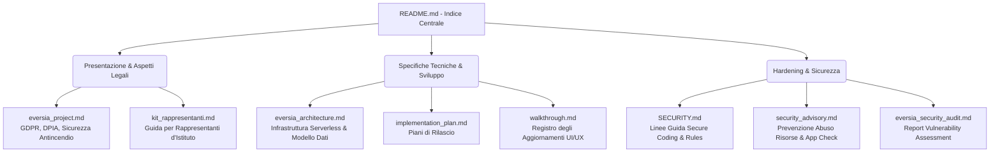

# 📖 Hub della Documentazione di Eversia

Benvenuto nel centro di controllo della documentazione di **Eversia** (MGA Assembly Manager). Questa cartella racchiude le specifiche tecniche, l'analisi dell'architettura serverless, le linee guida di secure coding e la documentazione legale di conformità GDPR sviluppata per il Liceo M.G. Agnesi.

Questo archivio è strutturato per essere presentato a dirigenti scolastici, DPO (Data Protection Officer), amministratori di sistema ed esaminatori.

---

## 🗺️ Mappa della Documentazione

Il grafico sottostante mostra la relazione tra le varie sezioni della documentazione:

---

## 📚 Indice dei Documenti

### 🏛️ Sezione 1: Presentazione e Aspetti Legali
*   **[Kit di Sbarco per Rappresentanti (kit_rappresentanti.md)](file:///Users/sajid/Documents/eversia/docs/kit_rappresentanti.md)**
    *   *Contenuto*: Una guida rapida, intuitiva e orientata al marketing per spiegare ai rappresentanti d'istituto delle altre scuole come digitalizzare la propria assemblea con Eversia e superare i dubbi di presidi e DPO.
*   **[Presentazione del Progetto & GDPR (eversia_project.md)](file:///Users/sajid/Documents/eversia/docs/eversia_project.md)**
    *   *Contenuto*: Descrizione del sistema di Identity & Access Management basato su domini istituzionali, scudo legale, conformità con il DPO (GDPR), misure preventive antincendio per il monitoraggio della capienza delle aule ed esportazione dei registri delle presenze.

### 🏗️ Sezione 2: Architettura e Sviluppo
*   **[Architettura Tecnica (eversia_architecture.md)](file:///Users/sajid/Documents/eversia/docs/eversia_architecture.md)**
    *   *Contenuto*: Analisi del Core Stack (React + TypeScript + Vite + Firebase), gerarchia dei ruoli dinamici (RBAC), flusso dei componenti mobili e desktop, e specifica dei modelli dati NoSQL di Firestore.
*   **[Piani di Rilascio (implementation_plan.md)](file:///Users/sajid/Documents/eversia/docs/implementation_plan.md)**
    *   *Contenuto*: Piani di integrazione delle Cloud Functions, implementazione della transazione ACID per i check-in ed evoluzione della piattaforma.
*   **[Registro delle Modifiche (walkthrough.md)](file:///Users/sajid/Documents/eversia/docs/walkthrough.md)**
    *   *Contenuto*: Registro illustrato dei rilasci dell'Area Studente, reskin grafico e micro-animazioni.

### 🛡️ Sezione 3: Hardening e Cybersecurity
*   **[Linee Guida di Secure Coding (SECURITY.md)](file:///Users/sajid/Documents/eversia/docs/SECURITY.md)**
    *   *Contenuto*: Principi di scrittura di codice sicuro (sanitizzazione input con DOMPurify, auto-escaping di React, validazione schema server-side con Zod) e regole di sicurezza Firestore (`firestore.rules`) ottimizzate per identificativo del documento (`request.auth.uid`).
*   **[Advisory di Sicurezza (security_advisory.md)](file:///Users/sajid/Documents/eversia/docs/security_advisory.md)**
    *   *Contenuto*: Analisi dei rischi relativi all'abuso di letture database (DDoS) e linee guida per l'integrazione di Firebase App Check mediante reCAPTCHA Enterprise.
*   **[Report del Security Audit (eversia_security_audit.md)](file:///Users/sajid/Documents/eversia/docs/eversia_security_audit.md)**
    *   *Contenuto*: Analisi approfondita di vulnerabilità (Vulnerability Assessment e Penetration Test teorico) eseguita sull'infrastruttura backend e sulle regole di accesso.

---

## 🛠️ Contribuire alla Documentazione

Per mantenere i file allineati con gli aggiornamenti del codice:
1.  **Tipografia**: Mantieni i titoli in *Sentence Case* e usa font geometrici coerenti per gli schemi visuali.
2.  **Riferimenti di Codice**: Usa sempre link cliccabili con schema `file:///` per puntare ai file sorgenti citati (es. `[App.tsx](file:///Users/sajid/Documents/eversia/client/src/App.tsx)`).
3.  **GDPR & Sicurezza**: Qualsiasi modifica alle regole Firestore o alla struttura dei cookie deve essere documentata in `SECURITY.md`.
