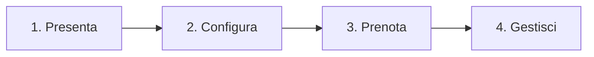

# 🧬 Come Digitalizzare l'Assemblea del tuo Istituto con Eversia
### *Guida Pratica per Rappresentanti d'Istituto ed Organizzatori*

---

## 📅 Il Problema di Ogni Assemblea (E come lo abbiamo risolto)

Se sei un rappresentante d'istituto, conosci benissimo il caos che si genera ad ogni assemblea nei corridoi e nelle aule:
1.  **Fogli di carta smarriti**: Appelli stampati che si perdono, firme illeggibili e professori infuriati perché non sanno dove siano gli studenti.
2.  **Aule al collasso**: Cento studenti ammassati in un laboratorio di informatica che può contenerne al massimo trenta, con gravi rischi per la **sicurezza antincendio** (D.Lgs. 81/08).
3.  **Mancanza di dati**: Nessuna idea di quali attività piacciano davvero e quali invece vengano deserte, rendendo impossibile pianificare l'evento successivo.

**Eversia** nasce da studenti per gli studenti proprio per azzerare questo caos, portando l'assemblea della tua scuola nel ventunesimo secolo con un'applicazione cloud-native moderna, veloce e sicura.

---

## ⚡ I Tre Pilastri di Eversia

### 1. Prenotazioni Intelligenti (Zero Overbooking)
Gli studenti si collegano all'app prima dell'assemblea e scelgono le attività che preferiscono per ciascun turno. 
*   **Algoritmo Anti-Collasso**: Appena un'aula raggiunge la capienza massima autorizzata, l'app blocca istantaneamente le prenotazioni per quella stanza. **Niente sovraffollamento, vie di fuga sempre libere.**

### 2. Appello Digitale Real-Time (Room Manager)
Ogni aula ha un gestore (*Room Manager*) munito di tablet o smartphone. 
*   **Check-in in un Tap**: Non serve carta. Il Room Manager fa l'appello direttamente sull'app. Il sistema registra la presenza in tempo reale e segnala immediatamente se uno studente sta provando a entrare in un laboratorio in cui non è prenotato (*"Imbucato"*).

### 3. Trasparenza per la Scuola & Sicurezza
A fine evento, con un solo click, puoi scaricare il registro presenze in formato Excel da consegnare in segreteria. Inoltre, il Dirigente Scolastico ha accesso a un pannello di monitoraggio in tempo reale per verificare i flussi in tempo reale.

---

## 🗺️ Il Percorso in 4 Step per Portare Eversia nella tua Scuola

### 1. Ottieni l'approvazione (Preside e DPO)
Presenta il progetto alla dirigenza. La domanda tipica dei professori è: *"E la privacy? E la sicurezza?"*. 
*   **Lo Scudo Legale**: Spiega che Eversia rispetta rigorosamente il GDPR. Il login è consentito **esclusivamente con l'email istituzionale** della scuola (`@istituto.edu.it`). Tutti i dati risiedono in server sicuri in Italia (Milano).
*   *Documento di riferimento*: Consegna al DPO della scuola l'**[Informativa GDPR ed Accesso Istituzionale](./eversia_project.md)**.

### 2. Configura la Logistica (Pannello Amministratore)
Una volta approvato il progetto, carichi l'elenco delle aule disponibili con le relative capienze e crei i gruppi di studio, i corsi o i dibattiti previsti per la giornata. Puoi creare template riutilizzabili per velocizzare le assemblee future.

### 3. Apri le Prenotazioni
Fornisci il link agli studenti. Ognuno accede con il proprio account Google d'istituto in un click (senza registrazioni complesse) e compone la propria agenda selezionando le attività nei turni previsti.

### 4. Il Giorno dell'Assemblea
I Room Manager gestiscono i check-in ai varchi. Tu controlli lo stato dell'assemblea dal monitor centralizzato, verifichi le statistiche di presenza ed esporti i file per i docenti.

---

> [!NOTE]
> **Nota per i rappresentanti**: Non devi preoccuparti della parte tecnica. Questa sezione è dedicata al Prof di Informatica o al Tecnico della tua scuola per mostrargli che il software è Enterprise-grade.

## 📂 Link Rapidi alla Documentazione Tecnica

Se i tecnici o i docenti del tuo istituto vogliono approfondire come implementare Eversia o come è strutturato il codice, puoi indirizzarli alle nostre guide ufficiali:

*   **[Guida all'Installazione (ADOPT.md)](../ADOPT.md)**: Come ospitare Eversia sul Cloud d'istituto (a costo zero).
*   **[Architettura Tecnica (eversia_architecture.md)](./eversia_architecture.md)**: Come sono organizzati il database (Firestore) e le rotte client.
*   **[Cybersecurity & Hardening (SECURITY.md)](./SECURITY.md)**: I dettagli tecnici sulla validazione dei tipi server-side e sulla protezione contro attacchi XSS e CSRF.
*   **[Advisory sui Rischi e App Check (security_advisory.md)](./security_advisory.md)**: Come abbiamo blindato il database contro tentativi di spam o bot con Firebase App Check.

---

*Fai fare il salto di qualità alla tua scuola. Digitalizza la tua assemblea con Eversia.*
