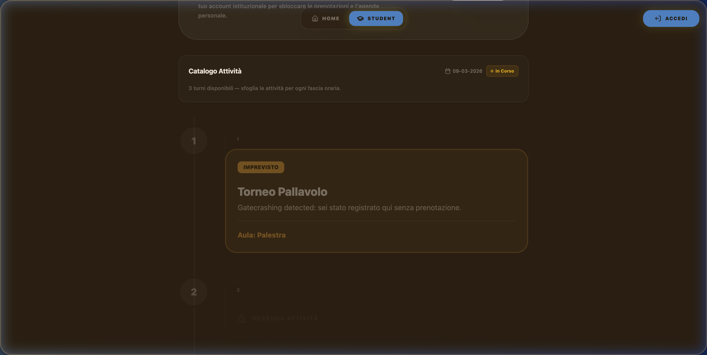
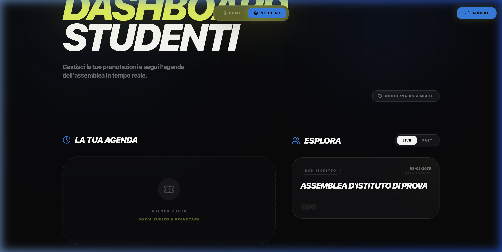
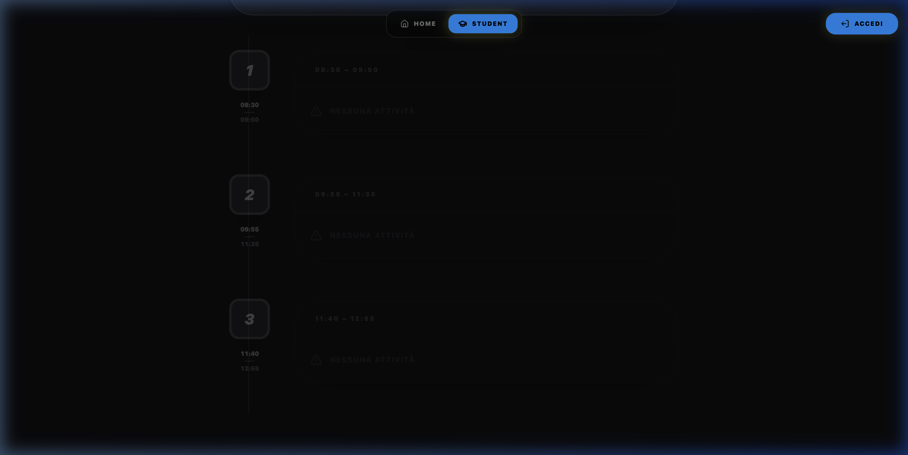
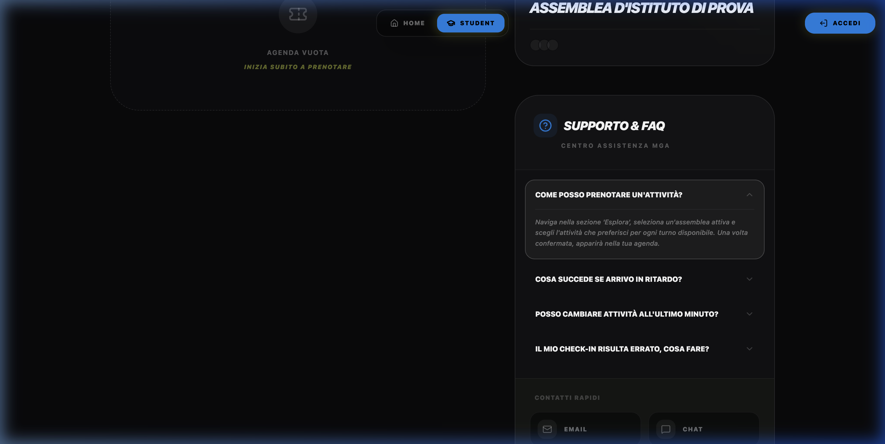

# Student Dashboard Redesign — Walkthrough

## Bug Risolto

`ActivityCatalog` filtrava con `a.turn_id` (legacy) → ora usa `a.turn_ids?.includes(turnId)`.

## Funzionalità Principali

| File | Cambiamento |
|------|-------------|
| [ActivityCatalog.tsx](file:///Users/sajid/Documents/mga_assembly-manager/client/src/components/StudentDashboard/AssemblyView/ActivityCatalog.tsx) | Bug fix + form verticale con card radio-style |
| [SummaryCard.tsx](file:///Users/sajid/Documents/mga_assembly-manager/client/src/components/StudentDashboard/AssemblyView/SummaryCard.tsx) | Progress stepper compatto + badge stato |
| [TimelineView.tsx](file:///Users/sajid/Documents/mga_assembly-manager/client/src/components/StudentDashboard/AssemblyView/TimelineView.tsx) | **Timeline Grafica**: linea verticale, orari integrati e **Gestione Imprevisti** (Gatecrashing) |
| [AgendaList.tsx](file:///Users/sajid/Documents/mga_assembly-manager/client/src/components/StudentDashboard/GlobalHome/AgendaList.tsx) | **Dettagli Agenda**: aggiunti orari turni e luoghi con stile Mission Control |
| [SupportWidget.tsx](file:///Users/sajid/Documents/mga_assembly-manager/client/src/components/StudentDashboard/GlobalHome/SupportWidget.tsx) | **Supporto & FAQ**: Nuovo modulo interattivo con FAQ ed help desk |
| [StudentDashboard.tsx](file:///Users/sajid/Documents/mga_assembly-manager/client/src/components/StudentDashboard.tsx) | Integrazione nuovi componenti e bug fix "Invalid Date" |

## Gestione Imprevisti (Gatecrashing)

Abbiamo aggiunto un sistema che rileva se uno studente è presente in un'aula diversa da quella prenotata.

- ⚠️ **Tema Amber**: La card diventa arancione per indicare una discrepanza.
- 🔔 **Badge Imprevisto**: Appare quando il check-in non corrisponde alla prenotazione.
- 📍 **Attività Reale**: Mostra il nome dell'attività che lo studente sta effettivamente frequentando, barrando quella originale.

## Timeline Grafica & Orari

- ✅ **Sidebar Orari**: Gli orari di inizio/fine sono ora visibili sotto i numeri dei turni.
- ✅ **Indicatori Grafici**: Ripristinata la linea verticale e i cerchi numerici grandi.
- ✅ **Fix Date**: Risolto il problema "Invalid Date" tramite validazione dei timestamp.

## Mission Control Aesthetic (Reskin)

Abbiamo allineato lo stile dell'Assembly View alla dashboard "Mission Control" (GlobalHome), utilizzando un design più premium e tecnico.

- 🎨 **Brand Lime & Neon**: Utilizzo massiccio del verde lime per pulsanti, progress bar e accenti.
- 📐 **Bordi Ultra-Rounded**: Card e pulsanti usano ora `rounded-3xl` o `rounded-[2.5rem]`.
- 🔠 **Premium Typography**: Header e titoli usano un font black, italico e uppercase per un look aggressivo e moderno.
- ✨ **Glassmorphism**: Sfondi scuri semi-trasparenti con `backdrop-blur-3xl`.

## Miglioramento Agenda (Global Home)

Abbiamo arricchito la sezione "La Tua Agenda" con informazioni dettagliate per ogni turno prenotato.

- 🕒 **Fasce Orarie**: Mostra l'orario di inizio e fine dell'attività (e.g., "09:00 — 10:30").
- 📍 **Luoghi Precisi**: Visualizzazione chiara dell'aula o della location assegnata.
- ⚡ **Indicatori Turno**: Nuovi badge tecnici (T1, T2...) per una lettura rapida.

## Correzione Bug "Invalid Date"

Abbiamo risolto il problema della visualizzazione "Invalid Date" che appariva nell'agenda e nella timeline. Adesso il sistema combina correttamente la data dell'evento con gli orari dei turni definiti nell'admin dashboard.

## Supporto & FAQ (Mission Control)

Abbiamo aggiunto un modulo di assistenza per aiutare gli studenti a navigare nel sistema e risolvere dubbi comuni.

- ❓ **FAQ Dinamiche**: Sistema di accordion per risposte rapide su prenotazioni, ritardi e check-in.
- ✉️ **Help Desk**: Collegamento rapido per contattare il supporto tecnico via email con indicazione dei tempi di risposta.
- 🛡️ **Stile Tecnico**: Integrato con il modulo "Secure Support v2.0" e accenti neon.

## Video Verifica

